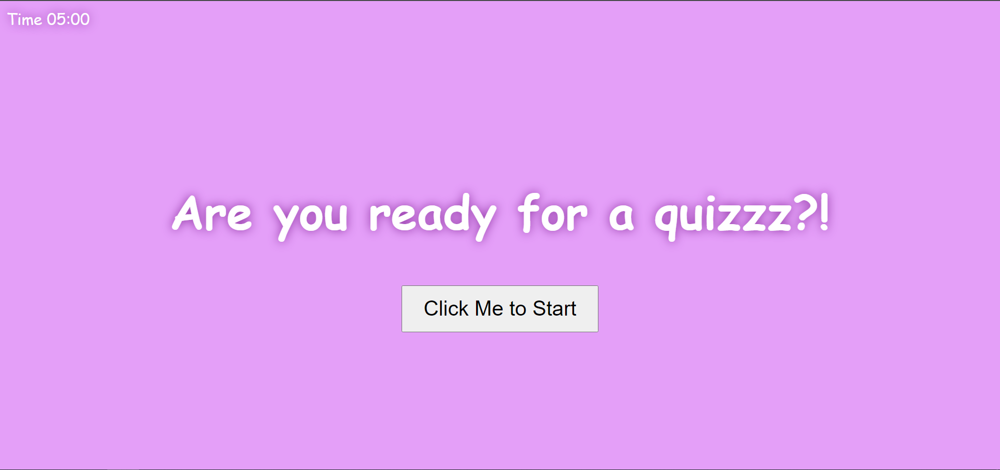

# JavaScript Quiz

## Description
This project is the source code of a web page that asks questions about JavaScript
You have 5 min to end the question
Currently there are only five questions but the project can support an endless amount if needed
Previous scores are stored locally

## Made by Klaus Cedillo

### Link
https://h0pe467.github.io/JsQuiz/

### Screenshot

